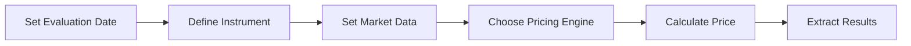

# Quick Start Guide

Get started with QuantLib instruments pricing in minutes.

## Installation

```bash
pip install QuantLib-Python numpy pandas matplotlib
```

## Basic Workflow

Every pricing operation follows these steps:



## Your First Pricing: European Option

```python
import QuantLib as ql
from datetime import datetime

# Step 1: Set evaluation date
calc_date = ql.Date(15, 1, 2025)
ql.Settings.instance().evaluationDate = calc_date

# Step 2: Define the instrument
strike = 105.0
maturity = ql.Date(15, 6, 2025)
payoff = ql.PlainVanillaPayoff(ql.Option.Call, strike)
exercise = ql.EuropeanExercise(maturity)
option = ql.VanillaOption(payoff, exercise)

# Step 3: Set market data
spot = 100.0
volatility = 0.20
risk_free_rate = 0.05
dividend_yield = 0.02

spot_handle = ql.QuoteHandle(ql.SimpleQuote(spot))
flat_ts = ql.YieldTermStructureHandle(
    ql.FlatForward(calc_date, risk_free_rate, ql.Actual365Fixed())
)
dividend_ts = ql.YieldTermStructureHandle(
    ql.FlatForward(calc_date, dividend_yield, ql.Actual365Fixed())
)
flat_vol_ts = ql.BlackVolTermStructureHandle(
    ql.BlackConstantVol(calc_date, ql.NullCalendar(), volatility, ql.Actual365Fixed())
)

# Step 4: Create pricing engine
bs_process = ql.BlackScholesMertonProcess(spot_handle, dividend_ts, flat_ts, flat_vol_ts)
engine = ql.AnalyticEuropeanEngine(bs_process)
option.setPricingEngine(engine)

# Step 5: Get results
print(f"Option Price: ${option.NPV():.2f}")
print(f"Delta: {option.delta():.4f}")
print(f"Gamma: {option.gamma():.6f}")
print(f"Vega: {option.vega():.4f}")
```

## Next: Interest Rate Swap

```python
# Define swap parameters
nominal = 1_000_000
fixed_rate = 0.05
maturity_years = 5

# Create schedules
effective_date = calc_date
termination_date = calc_date + ql.Period(maturity_years, ql.Years)

fixed_schedule = ql.Schedule(
    effective_date, termination_date,
    ql.Period(ql.Annual), ql.TARGET(),
    ql.ModifiedFollowing, ql.ModifiedFollowing,
    ql.DateGeneration.Forward, False
)

float_schedule = ql.Schedule(
    effective_date, termination_date,
    ql.Period(ql.Semiannual), ql.TARGET(),
    ql.ModifiedFollowing, ql.ModifiedFollowing,
    ql.DateGeneration.Forward, False
)

# Create swap
swap = ql.VanillaSwap(
    ql.VanillaSwap.Payer, nominal,
    fixed_schedule, fixed_rate, ql.Actual360(),
    float_schedule, ql.Euribor6M(), 0.0, ql.Actual360()
)

print(f"Swap NPV: ${swap.NPV():,.2f}")
```

## Common Patterns

### Pattern 1: Pricing with Different Engines

```python
engines = {
    "Analytic": ql.AnalyticEuropeanEngine(bs_process),
    "MC (10k paths)": ql.MCEuropeanEngine(bs_process, "PseudoRandom", timeSteps=20, requiredSamples=10000),
    "FD": ql.FdBlackScholesVanillaEngine(bs_process, 100, 100)
}

for name, eng in engines.items():
    option.setPricingEngine(eng)
    print(f"{name:20s}: ${option.NPV():.2f}")
```

### Pattern 2: Greeks Calculation

```python
def calculate_greeks(option):
    return {
        'price': option.NPV(),
        'delta': option.delta(),
        'gamma': option.gamma(),
        'vega': option.vega() / 100,  # per 1% vol change
        'theta': option.theta() / 365,  # per day
        'rho': option.rho() / 100  # per 1% rate change
    }

greeks = calculate_greeks(option)
for name, value in greeks.items():
    print(f"{name.capitalize():10s}: {value:10.4f}")
```

## Next Steps

- [Browse all instruments](../instruments/index.md)
- [See pricing examples](../examples/basic_pricing.ipynb)
- [Read API reference](../api/index.md)
