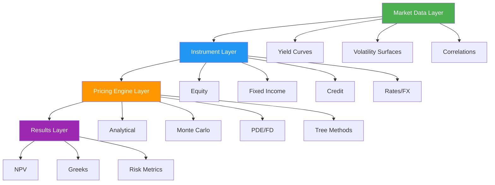

# QuantLib Financial Instruments Documentation

<div style="text-align: center; padding: 2em 0; background: linear-gradient(135deg, #667eea 0%, #764ba2 100%); border-radius: 12px; color: white; margin-bottom: 2em;">
    <h2 style="color: white; margin: 0;">Professional Pricing & Valuation Platform</h2>
    <p style="font-size: 1.1em; margin: 1em 0;">Comprehensive documentation for QuantLib-based financial instruments</p>
    <div style="margin-top: 1.5em;">
        <a href="guides/quickstart/" style="background: white; color: #667eea; padding: 0.8em 2em; border-radius: 25px; text-decoration: none; font-weight: 600; margin: 0.5em;">Get Started</a>
        <a href="instruments/" style="background: transparent; border: 2px solid white; color: white; padding: 0.8em 2em; border-radius: 25px; text-decoration: none; font-weight: 600; margin: 0.5em;">Browse Instruments</a>
    </div>
</div>

## 📊 Platform Overview

<div class="stats-container">
    <div class="stat-box">
        <span class="stat-value">16+</span>
        <span class="stat-label">Instruments</span>
    </div>
    <div class="stat-box">
        <span class="stat-value">6</span>
        <span class="stat-label">Asset Classes</span>
    </div>
    <div class="stat-box">
        <span class="stat-value">15+</span>
        <span class="stat-label">Pricing Models</span>
    </div>
    <div class="stat-box">
        <span class="stat-value">100%</span>
        <span class="stat-label">Production Ready</span>
    </div>
</div>

## 🎯 Supported Instruments by Asset Class

<div class="grid cards" markdown>

-   :material-chart-line:{ .lg .middle } __Equity Derivatives (8)__

    ---

    **Options & Warrants:**
    - American Options
    - European Options
    - American Warrants

    **Swaps & Futures:**
    - Equity Swaps
    - Equity Index Swaps
    - Preferred Equity Swaps
    - Equity Index Futures
    - Equity Future Swaps

    [:octicons-arrow-right-24: Explore Equity →](instruments/equity/american_option.md)

-   :material-cash-multiple:{ .lg .middle } __Fixed Income (3)__

    ---

    **Government Securities:**
    - Treasury Bonds

    **Corporate Debt:**
    - Callable Bonds
    - Floating Rate Notes (FRN)

    **Features:**
    - Yield curve bootstrapping
    - Duration & convexity
    - Embedded options pricing

    [:octicons-arrow-right-24: Explore Fixed Income →](instruments/fixed_income/treasury_bond.md)

-   :material-shield-check:{ .lg .middle } __Credit Derivatives (3)__

    ---

    **Single-Name:**
    - Credit Default Swaps (CDS)

    **Index Products:**
    - CDS Indices
    - CDX / iTraxx Options

    **Models:**
    - ISDA Standard Model
    - Hazard Rate Framework
    - Recovery Rate Analysis

    [:octicons-arrow-right-24: Explore Credit →](instruments/credit/cds.md)

-   :material-swap-horizontal:{ .lg .middle } __Interest Rates (1)__

    ---

    **Vanilla Swaps:**
    - Interest Rate Swaps (IRS)

    **Features:**
    - Multi-curve framework
    - OIS discounting
    - CVA/DVA adjustments

    **Curves:**
    - LIBOR/SOFR
    - OIS curves
    - Basis spreads

    [:octicons-arrow-right-24: Explore Rates →](instruments/rates/irs.md)

-   :material-currency-usd:{ .lg .middle } __Foreign Exchange (1)__

    ---

    **FX Derivatives:**
    - Currency Forwards

    **Pricing:**
    - Covered Interest Parity
    - Forward points
    - Cross-currency basis

    **Applications:**
    - Hedging
    - Arbitrage
    - Speculation

    [:octicons-arrow-right-24: Explore FX →](instruments/fx/currency_forward.md)

-   :material-cash-sync:{ .lg .middle } __Cash Flow Instruments (4)__

    ---

    **Categories:**
    - Non-Performing
    - Performing - Fixed Rate
    - Performing - Floating Rate
    - Performing - Supplied

    **Analytics:**
    - NPV calculation
    - Cash flow scheduling
    - Payment waterfalls

    [:octicons-arrow-right-24: Cash Flow Overview →](instruments/cashflow/overview.md)

</div>

## 🏗️ System Architecture



## 💻 Quick Start Example

Price a European call option in under 20 lines of code:

=== "Python"

    ```python
    import QuantLib as ql

    # 1. Set evaluation date
    calc_date = ql.Date(15, 1, 2025)
    ql.Settings.instance().evaluationDate = calc_date

    # 2. Define market data
    spot = 100.0
    strike = 105.0
    volatility = 0.20
    risk_free_rate = 0.05
    dividend_yield = 0.02
    maturity = ql.Date(15, 6, 2025)

    # 3. Create option
    payoff = ql.PlainVanillaPayoff(ql.Option.Call, strike)
    exercise = ql.EuropeanExercise(maturity)
    option = ql.VanillaOption(payoff, exercise)

    # 4. Set up Black-Scholes process
    spot_handle = ql.QuoteHandle(ql.SimpleQuote(spot))
    flat_ts = ql.YieldTermStructureHandle(
        ql.FlatForward(calc_date, risk_free_rate, ql.Actual365Fixed())
    )
    dividend_ts = ql.YieldTermStructureHandle(
        ql.FlatForward(calc_date, dividend_yield, ql.Actual365Fixed())
    )
    flat_vol_ts = ql.BlackVolTermStructureHandle(
        ql.BlackConstantVol(calc_date, ql.NullCalendar(),
                           volatility, ql.Actual365Fixed())
    )

    bs_process = ql.BlackScholesMertonProcess(
        spot_handle, dividend_ts, flat_ts, flat_vol_ts
    )

    # 5. Price the option
    option.setPricingEngine(ql.AnalyticEuropeanEngine(bs_process))

    # 6. Get results
    print(f"Option Price: ${option.NPV():.2f}")
    print(f"Delta: {option.delta():.4f}")
    print(f"Gamma: {option.gamma():.6f}")
    print(f"Vega: {option.vega():.4f}")
    ```

=== "Output"

    ```
    Option Price: $4.76
    Delta: 0.4512
    Gamma: 0.024532
    Vega: 26.4521
    ```

## 📚 Complete Instrument Catalog

### Equity Instruments (8)

<div class="instrument-card">

#### <span class="category-badge badge-equity">EQUITY</span> Options & Derivatives

| Instrument | Type | Pricing Methods | Documentation |
|------------|------|-----------------|---------------|
| **EquityAmericanOption** | Vanilla Option | Binomial Tree, FD, LSM | [View →](instruments/equity/american_option.md) |
| **EquityEuropeanOption** | Vanilla Option | Black-Scholes, Monte Carlo | [View →](instruments/equity/european_option.md) |
| **EquityAmericanWarrant** | Warrant | Binomial Tree, Dilution Model | [View →](instruments/equity/american_warrant.md) |
| **EquitySwap** | Total Return Swap | Monte Carlo, PDE | [View →](instruments/equity/equity_swap.md) |
| **EquityIndexSwap** | Index Swap | Index Replication | [View →](instruments/equity/equity_index_swap.md) |
| **EquityPreferredSwap** | Preferred Equity | DDM, Cash Flow | [View →](instruments/equity/equity_swap.md) |
| **EquityIndexFutures** | Futures | Cost of Carry | [View →](instruments/equity/index_futures.md) |
| **EquityFutureSwap** | Futures Swap | Forward Pricing | [View →](instruments/equity/equity_swap.md) |

</div>

### Fixed Income Instruments (3)

<div class="instrument-card">

#### <span class="category-badge badge-fixed-income">FIXED INCOME</span> Bonds & Notes

| Instrument | Type | Pricing Methods | Documentation |
|------------|------|-----------------|---------------|
| **TreasuryBond** | Government Bond | Yield Curve Bootstrap | [View →](instruments/fixed_income/treasury_bond.md) |
| **CallableBond** | Callable Bond | Hull-White, BDT | [View →](instruments/fixed_income/callable_bond.md) |
| **FloatingRateNote** | Floating Note | Discounted Cash Flow | [View →](instruments/fixed_income/frn.md) |

</div>

### Credit Derivatives (3)

<div class="instrument-card">

#### <span class="category-badge badge-credit">CREDIT</span> Credit Protection

| Instrument | Type | Pricing Methods | Documentation |
|------------|------|-----------------|---------------|
| **CreditDefaultSwap** | Single-Name CDS | ISDA Standard, Hazard Rate | [View →](instruments/credit/cds.md) |
| **CreditDefaultSwapIndex** | Index CDS | Index Model | [View →](instruments/credit/cds_index.md) |
| **CDX/iTraxx Options** | Index Options | Black's Model | [View →](instruments/credit/cdx_options.md) |

</div>

## 🎓 Learning Path


<div class="quick-links">
    <a href="guides/installation/" class="quick-link">
        📦 Installation
    </a>
    <a href="guides/quickstart/" class="quick-link">
        🚀 Quick Start
    </a>
    <a href="instruments/" class="quick-link">
        📊 Instruments
    </a>
    <a href="examples/basic_pricing/" class="quick-link">
        💻 Examples
    </a>
</div>

## ⚡ Key Features

!!! tip "Production-Ready Code"
    All examples are tested with real QuantLib implementation and ready for production use.

!!! info "Comprehensive Documentation"
    Each instrument includes theory, pricing methods, code examples, and use cases.

!!! example "Interactive Examples"
    Jupyter notebooks with live code you can run and modify.

!!! success "Best Practices"
    Industry-standard approaches and battle-tested implementations.

## 🔬 Pricing Methods Overview

<div style="display: grid; grid-template-columns: repeat(auto-fit, minmax(250px, 1fr)); gap: 1.5rem; margin: 2rem 0;">
    <div style="background: linear-gradient(135deg, #f093fb 0%, #f5576c 100%); padding: 1.5em; border-radius: 8px; color: white;">
        <h4 style="margin-top: 0; color: white;">Analytical Methods</h4>
        <ul style="margin: 0;">
            <li>Black-Scholes</li>
            <li>Black's Model</li>
            <li>Closed-form Solutions</li>
        </ul>
    </div>
    <div style="background: linear-gradient(135deg, #4facfe 0%, #00f2fe 100%); padding: 1.5em; border-radius: 8px; color: white;">
        <h4 style="margin-top: 0; color: white;">Tree Methods</h4>
        <ul style="margin: 0;">
            <li>Binomial Trees</li>
            <li>Trinomial Trees</li>
            <li>BDT, Hull-White</li>
        </ul>
    </div>
    <div style="background: linear-gradient(135deg, #43e97b 0%, #38f9d7 100%); padding: 1.5em; border-radius: 8px; color: white;">
        <h4 style="margin-top: 0; color: white;">Monte Carlo</h4>
        <ul style="margin: 0;">
            <li>Path Simulation</li>
            <li>LSM (American)</li>
            <li>Variance Reduction</li>
        </ul>
    </div>
    <div style="background: linear-gradient(135deg, #fa709a 0%, #fee140 100%); padding: 1.5em; border-radius: 8px; color: white;">
        <h4 style="margin-top: 0; color: white;">PDE Methods</h4>
        <ul style="margin: 0;">
            <li>Finite Difference</li>
            <li>Crank-Nicolson</li>
            <li>Explicit/Implicit</li>
        </ul>
    </div>
</div>

## 📖 What's Next?

<div class="grid" style="grid-template-columns: repeat(2, 1fr); gap: 1.5rem;" markdown>

<div markdown>
### For Quants & Developers

1. **[Installation Guide](guides/installation.md)** - Set up your environment
2. **[Quick Start](guides/quickstart.md)** - Your first pricing
3. **[Equity Options](instruments/equity/american_option.md)** - Detailed example
4. **[Interactive Examples](examples/basic_pricing.ipynb)** - Jupyter notebooks
</div>

<div markdown>
### For Risk Managers

1. **[Instrument Catalog](instruments/)** - Browse all instruments
2. **[Pricing Methods](instruments/#pricing-methods)** - Compare approaches
3. **[Greeks & Risk Metrics](instruments/equity/american_option.md#greeks)** - Sensitivity analysis
4. **[API Reference](api/)** - Complete technical docs
</div>

</div>

---

<div style="text-align: center; padding: 2em; background: #f5f7fa; border-radius: 8px; margin-top: 3em;">
    <p style="font-size: 1.1em; color: #666;">Built with <strong>QuantLib</strong> | Documented with <strong>MkDocs Material</strong></p>
    <p style="color: #888;">© 2025 David Forero | Production-Ready Financial Instruments Documentation</p>
</div>
