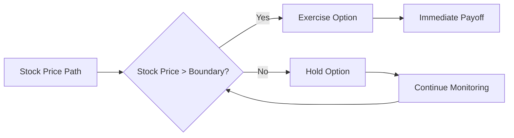

# Equity American Option

American-style equity options that can be exercised at any time before expiration.

## Overview

**Class:** `EquityAmericanOption`
**Category:** Equity
**Exercise Style:** American (early exercise allowed)

An American option gives the holder the right, but not the obligation, to buy (call) or sell (put) an underlying asset at a predetermined strike price at any time up to and including the expiration date.

## Features

- Early exercise capability
- Path-dependent valuation
- Greeks calculation (Delta, Gamma, Vega, Theta, Rho)
- Multiple pricing methods available

## Pricing Methods

### 1. Binomial Tree

The Cox-Ross-Rubinstein binomial tree model:

```python
import QuantLib as ql

# Market data
spot = 100.0
strike = 105.0
volatility = 0.20
risk_free_rate = 0.05
dividend_yield = 0.02

# Dates
calculation_date = ql.Date(15, 1, 2025)
maturity_date = ql.Date(15, 6, 2025)
ql.Settings.instance().evaluationDate = calculation_date

# Option setup
payoff = ql.PlainVanillaPayoff(ql.Option.Call, strike)
exercise = ql.AmericanExercise(calculation_date, maturity_date)
american_option = ql.VanillaOption(payoff, exercise)

# Market data handles
spot_handle = ql.QuoteHandle(ql.SimpleQuote(spot))
flat_ts = ql.YieldTermStructureHandle(
    ql.FlatForward(calculation_date, risk_free_rate, ql.Actual365Fixed())
)
dividend_ts = ql.YieldTermStructureHandle(
    ql.FlatForward(calculation_date, dividend_yield, ql.Actual365Fixed())
)
flat_vol_ts = ql.BlackVolTermStructureHandle(
    ql.BlackConstantVol(calculation_date, ql.NullCalendar(), volatility, ql.Actual365Fixed())
)

# Black-Scholes process
bs_process = ql.BlackScholesMertonProcess(
    spot_handle, dividend_ts, flat_ts, flat_vol_ts
)

# Binomial engine with 100 steps
binomial_engine = ql.BinomialVanillaEngine(bs_process, "crr", 100)
american_option.setPricingEngine(binomial_engine)

# Results
print(f"American Call Option Price: ${american_option.NPV():.2f}")
print(f"Delta: {american_option.delta():.4f}")
print(f"Gamma: {american_option.gamma():.4f}")
print(f"Vega: {american_option.vega():.4f}")
```

### 2. Finite Difference Method

For greater accuracy with complex payoffs:

```python
# Finite Difference engine
fd_engine = ql.FdBlackScholesVanillaEngine(bs_process, 100, 100)
american_option.setPricingEngine(fd_engine)

print(f"FD Price: ${american_option.NPV():.2f}")
```

### 3. Least Squares Monte Carlo (LSM)

For path-dependent features:

```python
# LSM Monte Carlo engine
lsm_engine = ql.MCAmericanEngine(
    bs_process,
    "PseudoRandom",
    timeSteps=100,
    polynomOrder=2,
    seedCalibration=42,
    requiredSamples=10000
)
american_option.setPricingEngine(lsm_engine)

print(f"LSM MC Price: ${american_option.NPV():.2f}")
```

## Greeks

The sensitivity measures (Greeks) help understand risk:

| Greek | Description | Interpretation |
|-------|-------------|----------------|
| **Delta** | $\frac{\partial V}{\partial S}$ | Change in option value per $1 change in underlying |
| **Gamma** | $\frac{\partial^2 V}{\partial S^2}$ | Rate of change of Delta |
| **Vega** | $\frac{\partial V}{\partial \sigma}$ | Sensitivity to volatility changes |
| **Theta** | $\frac{\partial V}{\partial t}$ | Time decay |
| **Rho** | $\frac{\partial V}{\partial r}$ | Sensitivity to interest rate changes |

## Early Exercise Boundary



## Pricing Comparison

```python
# Compare different methods
methods = {
    "Binomial (100 steps)": ql.BinomialVanillaEngine(bs_process, "crr", 100),
    "Binomial (200 steps)": ql.BinomialVanillaEngine(bs_process, "crr", 200),
    "Finite Difference": ql.FdBlackScholesVanillaEngine(bs_process, 100, 100),
}

print("\nPricing Method Comparison:")
print("-" * 50)
for name, engine in methods.items():
    american_option.setPricingEngine(engine)
    print(f"{name:25s}: ${american_option.NPV():8.2f}")
```

## Early Exercise Premium

The American option value can be decomposed as:

$$
V_{American} = V_{European} + \text{Early Exercise Premium}
$$

```python
# Calculate early exercise premium
european_exercise = ql.EuropeanExercise(maturity_date)
european_option = ql.VanillaOption(payoff, european_exercise)
european_option.setPricingEngine(ql.AnalyticEuropeanEngine(bs_process))

premium = american_option.NPV() - european_option.NPV()
print(f"\nEarly Exercise Premium: ${premium:.2f}")
```

## Use Cases

### Portfolio Hedging

American puts provide flexible downside protection:

```python
# Protective put strategy
put_payoff = ql.PlainVanillaPayoff(ql.Option.Put, strike)
put_exercise = ql.AmericanExercise(calculation_date, maturity_date)
protective_put = ql.VanillaOption(put_payoff, put_exercise)
protective_put.setPricingEngine(binomial_engine)

portfolio_value = spot + protective_put.NPV()
print(f"Protected Portfolio Value: ${portfolio_value:.2f}")
```

### Employee Stock Options

Modeling ESOs with vesting periods:

```python
# ESO with vesting
vesting_date = ql.Date(15, 3, 2025)
eso_exercise = ql.AmericanExercise(vesting_date, maturity_date)
eso = ql.VanillaOption(payoff, eso_exercise)
eso.setPricingEngine(binomial_engine)

print(f"ESO Value: ${eso.NPV():.2f}")
```

## Parameters

| Parameter | Type | Description | Example |
|-----------|------|-------------|---------|
| `underlying_price` | float | Current stock price | 100.0 |
| `strike_price` | float | Exercise price | 105.0 |
| `volatility` | float | Implied volatility | 0.20 |
| `risk_free_rate` | float | Risk-free interest rate | 0.05 |
| `dividend_yield` | float | Continuous dividend yield | 0.02 |
| `maturity_date` | Date | Expiration date | 2025-06-15 |
| `option_type` | str | "Call" or "Put" | "Call" |

## Best Practices

!!! tip "Convergence"
    Use at least 100 time steps for binomial trees to ensure convergence

!!! warning "Dividends"
    American calls on non-dividend paying stocks should never be exercised early

!!! info "Computational Cost"
    Finite difference methods are faster for single options, Monte Carlo for portfolios

## References

- [European Option](european_option.md) - Comparison with European-style
- [Equity Warrants](american_warrant.md) - Similar instrument with dilution
- [Pricing Examples](../../examples/basic_pricing.ipynb) - Interactive notebook

## API Reference

```python
class EquityAmericanOption:
    """
    American-style equity option with early exercise.

    Attributes:
        underlying: Underlying stock
        strike: Exercise price
        maturity: Expiration date
        option_type: Call or Put

    Methods:
        price(): Calculate option value
        greeks(): Return all Greeks
        exercise_boundary(): Optimal exercise boundary
    """
```

## See Also

- [Black-Scholes Model](../../guides/models/black_scholes.md)
- [Binomial Trees](../../guides/models/binomial.md)
- [Monte Carlo Methods](../../guides/models/monte_carlo.md)
