# Financial Instruments Overview

Complete reference for all supported financial instruments.

## Instruments by Category

### Equity Instruments

| Instrument Class | Description | Pricing Methods |
|-----------------|-------------|-----------------|
| **EquitySwap** | Exchange of cash flows based on equity return | Monte Carlo, PDE |
| **EquityIndexSwap** | Swap based on equity index performance | Index Replication |
| **EquityAmericanWarrant** | American-style equity warrant | Binomial Tree, Finite Difference |
| **EquityAmericanOption** | American-style equity option | LSM, Binomial Tree |
| **EquityEuropeanOption** | European-style equity option | Black-Scholes, Monte Carlo |
| **EquityPreferredSwap** | Swap on preferred stock | Dividend Discount Model |
| **EquityIndexFutures** | Futures on equity index | Cost of Carry |
| **EquityFutureSwap** | Swap on equity futures | Futures Pricing |

[Explore Equity Instruments →](equity/equity_swap.md)

### Fixed Income Instruments

| Instrument Class | Description | Pricing Methods |
|-----------------|-------------|-----------------|
| **TreasuryBond** | Government-issued bond | Yield Curve Bootstrapping |
| **CallableBond** | Bond with embedded call option | Hull-White, Black-Derman-Toy |
| **FloatingRateNote** | Variable rate bond | Discounted Cash Flow, LIBOR Curve |

[Explore Fixed Income →](fixed_income/treasury_bond.md)

### Credit Derivatives

| Instrument Class | Description | Pricing Methods |
|-----------------|-------------|-----------------|
| **CreditDefaultSwap** | Protection against credit events | Hazard Rate Model, ISDA Standard |
| **CreditDefaultSwapIndex** | CDS on index of credits | Index CDS Model |
| **CDX / iTraxx Options** | Options on CDS indices | Black's Model |

[Explore Credit Derivatives →](credit/cds.md)

### Interest Rate Derivatives

| Instrument Class | Description | Pricing Methods |
|-----------------|-------------|-----------------|
| **InterestRateSwap** | Exchange of fixed/floating payments | Multi-Curve Framework, OIS Discounting |

[Explore Interest Rate Derivatives →](rates/irs.md)

### FX Derivatives

| Instrument Class | Description | Pricing Methods |
|-----------------|-------------|-----------------|
| **CurrencyForward** | Forward contract on FX pair | Covered Interest Parity |

[Explore FX Derivatives →](fx/currency_forward.md)

### Cash Flow Instruments

| Instrument Class | Description |
|-----------------|-------------|
| **CashFlow:NonPerforming** | Non-performing cash flows |
| **CashFlow:PerformingSupplied** | Performing supplied cash flows |
| **CashFlow:PerformingFloatingRate** | Floating rate performing cash flows |
| **CashFlow:PerformingFixedRate** | Fixed rate performing cash flows |

[Explore Cash Flow Instruments →](cashflow/overview.md)

## Instrument Categories

```mermaid
%%{init: {'theme':'base', 'themeVariables': { 'primaryColor':'#E8F5E9','primaryTextColor':'#1B5E20','primaryBorderColor':'#4CAF50','lineColor':'#66BB6A','secondaryColor':'#FFF3E0','tertiaryColor':'#E3F2FD','fontSize':'16px'}}}%%
graph TB
    Root["<b>Financial Instruments</b><br/>16+ Instruments"]

    Equity["<b>📈 Equity</b><br/>8 Instruments<br/><i>Options, Swaps, Futures</i>"]
    Fixed["<b>💰 Fixed Income</b><br/>3 Instruments<br/><i>Bonds, Notes</i>"]
    Credit["<b>🛡️ Credit</b><br/>3 Instruments<br/><i>CDS, Protection</i>"]
    Rates["<b>📊 Interest Rates</b><br/>1 Instrument<br/><i>Swaps</i>"]
    FX["<b>💱 Foreign Exchange</b><br/>1 Instrument<br/><i>Forwards</i>"]
    CashFlow["<b>💵 Cash Flow</b><br/>4 Instruments<br/><i>Performing, NPL</i>"]

    Root --> Equity
    Root --> Fixed
    Root --> Credit
    Root --> Rates
    Root --> FX
    Root --> CashFlow

    Equity --> EqOption["American/European Options<br/>Vanilla & Exotic"]
    Equity --> EqSwap["Equity Swaps<br/>Total Return"]
    Equity --> EqFutures["Index Futures<br/>Forward Contracts"]

    Fixed --> Treasury["Treasury Bonds<br/>Government Securities"]
    Fixed --> Callable["Callable Bonds<br/>Embedded Options"]
    Fixed --> FRN["Floating Rate Notes<br/>Variable Coupons"]

    Credit --> CDS["Credit Default Swaps<br/>Single-Name Protection"]
    Credit --> CDSIdx["CDS Indices<br/>Portfolio Protection"]
    Credit --> CDXOpt["Index Options<br/>CDX/iTraxx"]

    Rates --> IRS["Interest Rate Swaps<br/>Fixed vs Floating"]

    FX --> FWD["Currency Forwards<br/>FX Hedging"]

    CashFlow --> CF1["Non-Performing<br/>Distressed Assets"]
    CashFlow --> CF2["Performing Fixed<br/>Fixed Rate CF"]

    style Root fill:#667eea,stroke:#764ba2,stroke-width:4px,color:#fff
    style Equity fill:#E8F5E9,stroke:#4CAF50,stroke-width:3px,color:#1B5E20
    style Fixed fill:#FFF3E0,stroke:#FF9800,stroke-width:3px,color:#E65100
    style Credit fill:#FFEBEE,stroke:#F44336,stroke-width:3px,color:#C62828
    style Rates fill:#F3E5F5,stroke:#9C27B0,stroke-width:3px,color:#6A1B9A
    style FX fill:#E0F7FA,stroke:#00BCD4,stroke-width:3px,color:#006064
    style CashFlow fill:#FFF9C4,stroke:#FFC107,stroke-width:3px,color:#F57F17

    style EqOption fill:#C8E6C9,stroke:#4CAF50,stroke-width:2px
    style EqSwap fill:#C8E6C9,stroke:#4CAF50,stroke-width:2px
    style EqFutures fill:#C8E6C9,stroke:#4CAF50,stroke-width:2px

    style Treasury fill:#FFE0B2,stroke:#FF9800,stroke-width:2px
    style Callable fill:#FFE0B2,stroke:#FF9800,stroke-width:2px
    style FRN fill:#FFE0B2,stroke:#FF9800,stroke-width:2px

    style CDS fill:#FFCDD2,stroke:#F44336,stroke-width:2px
    style CDSIdx fill:#FFCDD2,stroke:#F44336,stroke-width:2px
    style CDXOpt fill:#FFCDD2,stroke:#F44336,stroke-width:2px

    style IRS fill:#E1BEE7,stroke:#9C27B0,stroke-width:2px
    style FWD fill:#B2EBF2,stroke:#00BCD4,stroke-width:2px
    style CF1 fill:#FFF59D,stroke:#FFC107,stroke-width:2px
    style CF2 fill:#FFF59D,stroke:#FFC107,stroke-width:2px
```



<div style="text-align: center; margin-top: 1em; color: #666; font-size: 0.9em;">
Interactive diagram showing all 16+ financial instruments organized by asset class
</div>

## Common Attributes

All instruments share these common properties:

- **Valuation Date**: Current market date for pricing
- **Market Data**: Curves, volatilities, correlations
- **Pricing Engine**: Calculation methodology
- **Calendar**: Business day conventions
- **Day Count Convention**: Interest accrual method

## Quick Navigation

=== "By Asset Class"

    - [Equity](equity/equity_swap.md)
    - [Fixed Income](fixed_income/treasury_bond.md)
    - [Credit](credit/cds.md)
    - [Rates](rates/irs.md)
    - [FX](fx/currency_forward.md)

=== "By Complexity"

    **Basic:**
    - European Options
    - Treasury Bonds
    - Currency Forwards

    **Intermediate:**
    - American Options
    - Floating Rate Notes
    - Interest Rate Swaps

    **Advanced:**
    - Credit Default Swaps
    - Callable Bonds
    - Equity Swaps

<div id="pricing-methods"></div>

=== "By Pricing Method"

    **Analytical:**
    - Black-Scholes (European Options)
    - Black's Model (Swaptions)

    **Numerical:**
    - Binomial Trees (American Options)
    - Monte Carlo (Path-Dependent)
    - Finite Differences (PDEs)

## Example Usage

```python
import QuantLib as ql

# Common setup for all instruments
calculation_date = ql.Date(15, 1, 2025)
ql.Settings.instance().evaluationDate = calculation_date

# Example 1: European Equity Option
option = ql.VanillaOption(
    ql.PlainVanillaPayoff(ql.Option.Call, 100.0),
    ql.EuropeanExercise(ql.Date(15, 6, 2025))
)

# Example 2: Interest Rate Swap
swap = ql.VanillaSwap(
    ql.VanillaSwap.Payer,
    1000000,  # Notional
    fixed_schedule,
    0.05,  # Fixed rate
    ql.Actual360(),
    float_schedule,
    ql.Euribor6M(),
    0.0,  # Spread
    ql.Actual360()
)

# Example 3: Credit Default Swap
cds = ql.CreditDefaultSwap(
    ql.Protection.Buyer,
    10000000,  # Notional
    0.01,  # Spread
    schedule,
    ql.Following,
    ql.Actual360()
)
```

## See Also

- [Getting Started Guide](../guides/quickstart.md)
- [Pricing Examples](../examples/basic_pricing.ipynb)
- [API Reference](../api/index.md)
